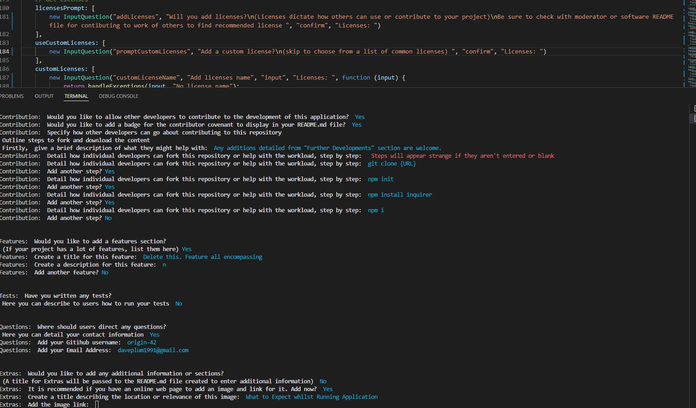

<div align="center">

# Readme Generator
  
</div>

<div align="center">

  
[](https://www.gnu.org/licenses/gpl-3.0) [](https://www.contributor-covenant.org/version/2/1/code_of_conduct/code_of_conduct.md) [](https://nodejs.org/en/)

</div>


### Motivation

Uploading many projects online requires a lot of time writing and remembering information to include in a readme, whilst also ensuring correct formatting. Here we can simply type the desired information and formatting will be completed consistently, whilst ensuring all information is entered.

### Problem

Saves time searching for information that will be the same everytime. Ensures consistency across applications. Clean and presenteable README.md file. 

### Information

The purpose of this application additionally served to further my knowledge with the enquirer package for prompts made with node.js.

## Requirements

Node will be required to this this application on a local terminal. 

## Further Developments

### Additional Features

- Updates to inquirer confirmation prompts will require further validation to improve exceptions when a user enters any character, rather than just 'n' to omit a feature. 

- Allow a user to begin application and add additional information pertaining to how the applicaion works prior to running in the terminal to provide additional context.

- Allow users to inser information anywhere they wish or rather "sort" where features will be added after user finished entering information.

### Further Changes

- Unable to add colouring to prefix information due to requirments of altering module path which is changed when a user downloads inquirer. Potential to add adjustment to alter return response to questions entered.

- Further spacing and UI changes required.

- Further implementation of promise handling could server to refractor code.

## Table of Contents

* [Installation](#installation)
* [How to Use](#how-to-use)
* [Credits](#credits)
* [Contribution](#contribution)
* [Questions](#questions)

## Installation


```
Copy github URL path
CLONE;
git clone {url} (open inside text editor)
```

Open file in preferred file edittor.
Refer to "How to Use"

## How to Use

Download application from Github and install dependancies, node and inquirer.


```
open console {crtl `}
enter: {npm i inquirer} - install inquirer
enter: {node index.js} - run generator
```

### How to Run Application - Click Image to Redirect

[](https://youtu.be/GcAtN6wYZwQ "Link Title")

## Credits

[Regular Expressions for Email](https://www.simplilearn.com/tutorials/javascript-tutorial/email-validation-in-javascript): simplilearn.com

[Screen Capture](https://www.screencapture.com/): Used to Develop this Video

[Badges](https://github.com/aleen42/badges): [aleen42](https://github.com/aleen42/): Usage of Badges

[Contributor Covenant](https://www.contributor-covenant.org/)

[Choose a License](https://choosealicense.com/): Licenses for distribution of software

[Origin-42](https://github.com/origin-42): Dave Plummer

## Contribution

Any additions detailed from "Further Developments" section are welcome.

### How to Contribute

```
git init
git branch -b {branch_name}
git push -u origin {branch_name}
```

create pull request
Describe additions and what this will address

## Questions

Direct any questions too;

- [origin-42](https://github.com/origin-42)
- daveplum1991@gmail.com

## Extras

[What to Expect Whilst This Running Application](./utils/images/generator_screenshot.jpg)



